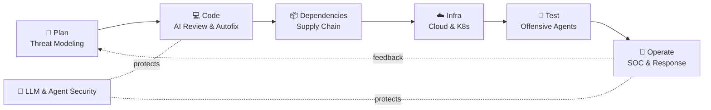

<!-- ⚠️ GENERATED FILE — do not edit README.md directly. -->
<!-- Edit data/agents.json and run `npm run readme` to regenerate. -->

# Awesome Agentic DevSecOps 🛡️🤖

**A curated atlas of AI agents that secure the software lifecycle — from threat modeling to SOC response.**

🌐 **[Explore the interactive atlas →](https://shivc04.github.io/awesome-agentic-devsecops/)**

---

## What is this?

Security teams are drowning in alerts, reviews, and audits — and a new generation of **AI agents** is taking over the repetitive parts. This list maps that landscape end to end: **74 curated agents** — 39 open source, 32 commercial, 3 research — organized by where they act in the software lifecycle.

Every entry is checked for a working link and a real, shipped capability. No vaporware.

## Contents

- [Threat Modeling & Design](#threat-modeling--design) — 2 agents
- [Code Security & Review](#code-security--review) — 13 agents
- [Dependencies & Supply Chain](#dependencies--supply-chain) — 3 agents
- [Infrastructure, Cloud & Kubernetes](#infrastructure-cloud--kubernetes) — 6 agents
- [Offensive Security & Pentesting](#offensive-security--pentesting) — 13 agents
- [SOC, Detection & Response](#soc-detection--response) — 12 agents
- [LLM & Agent Security](#llm--agent-security) — 12 agents
- [Compliance & Governance](#compliance--governance) — 2 agents
- [Frameworks & Building Blocks](#frameworks--building-blocks) — 11 agents
- [Contributing](#contributing)
- [License](#license)

---

### Threat Modeling & Design

> Agents that reason about architecture and attack surface before a line of code ships.

| Project | Type | Description | Links |
|---|---|---|---|
| **STRIDE GPT** | 🟢 Open Source | AI-powered threat modeling that generates STRIDE threat models, attack trees, and mitigations from an application description. | [Code](https://github.com/mrwadams/stride-gpt) |
| **IriusRisk Jeff** | 🟣 Commercial | AI threat-modeling assistant inside IriusRisk that turns architecture diagrams and design docs into draft threat models. | [Site](https://www.iriusrisk.com) |

### Code Security & Review

> AI reviewers and fixers that find, triage, and patch vulnerabilities in source code and pull requests.

| Project | Type | Description | Links |
|---|---|---|---|
| **Claude Code Security Review** | 🟢 Open Source | GitHub Action from Anthropic that runs Claude against every pull request for semantic, context-aware security review. | [Code](https://github.com/anthropics/claude-code-security-review) |
| **Aardvark (Codex Security)** | 🟣 Commercial | OpenAI's agentic security researcher: continuously scans repos, validates exploitability in a sandbox, and proposes patches. Now part of Codex Security. | [Site](https://openai.com/index/introducing-aardvark/) |
| **GitHub Copilot Autofix** | 🟣 Commercial | AI-generated fixes for CodeQL code-scanning alerts, proposed directly on pull requests via GitHub Advanced Security. | [Site](https://github.com/features/security) |
| **Semgrep Assistant** | 🟣 Commercial | AI layer of the Semgrep AppSec platform that triages findings, filters false positives, and drafts remediation guidance. | [Site](https://semgrep.dev) |
| **Snyk Agent Fix** | 🟣 Commercial | Snyk's DeepCode AI engine powering automated vulnerability fixes and self-healing pull requests, trained on curated security data. | [Site](https://snyk.io) |
| **GitLab Duo Vulnerability Resolution** | 🟣 Commercial | GitLab's AI suite that explains SAST vulnerabilities and opens merge requests to resolve them inside the DevSecOps platform. | [Site](https://about.gitlab.com/gitlab-duo/) |
| **Corgea** | 🟣 Commercial | AI AppSec engineer that scans with business-logic context, filters false positives, and auto-generates fixes as pull requests. | [Site](https://corgea.com) |
| **Mobb** | 🟣 Commercial | Automatic vulnerability fixer that consumes SAST reports (Snyk, Checkmarx, CodeQL, Semgrep) and commits verified remediations. | [Site](https://mobb.ai) |
| **Pixee** | 🟣 Commercial | Automated product-security engineer (pixeebot) that continuously hardens code and fixes findings through pull requests. | [Site](https://pixee.ai) |
| **ZeroPath** | 🟣 Commercial | AI-native SAST that finds business-logic and code vulnerabilities and ships PR-ready patches. | [Site](https://zeropath.com) |
| **DryRun Security** | 🟣 Commercial | Contextual security analysis for pull requests using AI agents that reason about authz, injection, and business-logic risk. | [Site](https://www.dryrun.security) |
| **Vulnhuntr** | 🟢 Open Source | LLM-based static analyzer that autonomously chains multi-step, remotely exploitable vulnerabilities in Python code — credited with real 0-days. | [Code](https://github.com/protectai/vulnhuntr) |
| **Ghost Security** | 🟣 Commercial | Agentic application-security platform whose autonomous agents map applications, APIs, and vulnerabilities at enterprise scale. | [Site](https://ghost.security) |

### Dependencies & Supply Chain

> Agents watching what you import — malicious packages, risky upgrades, and reachability.

| Project | Type | Description | Links |
|---|---|---|---|
| **Socket** | 🟣 Commercial | Supply-chain security that uses AI to analyze package behavior and block malicious or risky open-source dependencies before they land. | [Site](https://socket.dev) |
| **Endor Labs** | 🟣 Commercial | Reachability-based SCA with AI agents that review code changes, prioritize exploitable dependency risk, and guide safe upgrades. | [Site](https://www.endorlabs.com) |
| **Aikido Security** | 🟣 Commercial | Code-to-cloud security platform with AI AutoFix spanning dependencies, SAST, secrets, and IaC findings. | [Site](https://www.aikido.dev) |

### Infrastructure, Cloud & Kubernetes

> AI for IaC remediation, cluster diagnosis, and cloud-native runtime security.

| Project | Type | Description | Links |
|---|---|---|---|
| **K8sGPT** | 🟢 Open Source | CNCF tool that scans Kubernetes clusters and explains problems in plain English — SRE expertise encoded as analyzers with pluggable LLM backends. | [Code](https://github.com/k8sgpt-ai/k8sgpt) |
| **kubectl-ai** | 🟢 Open Source | AI-powered Kubernetes agent from Google that translates natural-language intent into safe kubectl operations. | [Code](https://github.com/GoogleCloudPlatform/kubectl-ai) |
| **HolmesGPT** | 🟢 Open Source | 24/7 AI on-call agent that investigates alerts from Prometheus, PagerDuty, and more by pulling live cluster data and correlating root cause. | [Code](https://github.com/HolmesGPT/holmesgpt) |
| **Gomboc.ai** | 🟣 Commercial | Deterministic AI remediation for cloud infrastructure: generates policy-compliant fixes for Terraform and CloudFormation. | [Site](https://gomboc.ai) |
| **Sysdig Sage** | 🟣 Commercial | AI cloud-security analyst built on runtime insights — multi-step reasoning over CNAPP findings from detection to remediation. | [Site](https://sysdig.com) |
| **kagent** | 🟢 Open Source | CNCF framework for running agentic AI natively in Kubernetes — declarative agents and MCP tools for DevOps, troubleshooting, and security operations. | [Code](https://github.com/kagent-dev/kagent) |

### Offensive Security & Pentesting

> Autonomous red teams: agents that probe, exploit, fuzz, and validate — so defenders find it first.

| Project | Type | Description | Links |
|---|---|---|---|
| **XBOW** | 🟣 Commercial | Autonomous penetration tester that reached #1 on HackerOne's US leaderboard, finding and validating exploits without human operators. | [Site](https://xbow.com) |
| **PentestGPT** | 🟢 Open Source | GPT-powered penetration-testing assistant that guides recon, exploitation, and privilege escalation — backed by USENIX Security research. | [Code](https://github.com/GreyDGL/PentestGPT) |
| **Darkmoon** | 🟢 Open Source | Open source (GPL-3.0) autonomous AI penetration testing platform covering web, API, Active Directory and Kubernetes, exposed to agents through a built in MCP server. | [GitHub](https://github.com/ASCIT31/Dark-Moon) |
| **PentAGI** | 🟢 Open Source | Fully autonomous multi-agent pentesting system — specialized agents with isolated Docker tooling, long-term memory, and reporting. | [Code](https://github.com/vxcontrol/pentagi) |
| **hackingBuddyGPT** | 🟢 Open Source | Research framework from TU Wien for building LLM agents that attempt privilege escalation and web pentests autonomously. | [Code](https://github.com/ipa-lab/hackingBuddyGPT) |
| **HexStrike AI** | 🟢 Open Source | MCP server that lets AI agents orchestrate 150+ security tools — nmap, Burp, Metasploit — for automated recon and exploitation workflows. | [Code](https://github.com/0x4m4/hexstrike-ai) |
| **BurpGPT** | 🟢 Open Source | Burp Suite extension that adds LLM-powered passive scanning and traffic analysis to web security testing. | [Code](https://github.com/aress31/burpgpt) |
| **Nebula** | 🟢 Open Source | AI-powered ethical-hacking assistant that wraps nmap, ZAP, and other tools with natural-language control. | [Code](https://github.com/berylliumsec/nebula) |
| **OSS-Fuzz-Gen** | 🟢 Open Source | Google's LLM framework that generates and improves fuzz targets for OSS-Fuzz — already surfacing real-world vulnerabilities. | [Code](https://github.com/google/oss-fuzz-gen) |
| **Google Big Sleep** | 🟡 Research | Project Zero × DeepMind agent that hunts memory-safety bugs in real software — found an exploitable SQLite flaw before release. | [Site](https://googleprojectzero.blogspot.com/2024/10/from-naptime-to-big-sleep.html) |
| **Atlantis** | 🟢 Open Source | Team Atlanta's cyber-reasoning system that won DARPA's AI Cyber Challenge — autonomous vulnerability discovery and patching at scale. | [Code](https://github.com/Team-Atlanta/aixcc-afc-atlantis) |
| **Buttercup** | 🟢 Open Source | Trail of Bits' open-sourced AIxCC cyber-reasoning system: agents that autonomously find and patch vulnerabilities in C and Java. | [Code](https://github.com/trailofbits/buttercup) |
| **Cybench** | 🟡 Research | Stanford benchmark evaluating LLM agents on professional CTF tasks — the reference eval for offensive agent capability. | [Code](https://github.com/andyzorigin/cybench) |
| **Escape** | 🟣 Commercial | Agentic DAST for APIs and business logic — AI agents explore, attack, and validate findings against running applications. | [Site](https://escape.tech) |

### SOC, Detection & Response

> AI analysts that triage alerts, investigate incidents, and write detections around the clock.

| Project | Type | Description | Links |
|---|---|---|---|
| **Microsoft Security Copilot** | 🟣 Commercial | Microsoft's generative-AI security suite with agents for phishing triage, alert investigation, and posture across Defender and Sentinel. | [Site](https://www.microsoft.com/en-us/security/business/ai-machine-learning/microsoft-security-copilot) |
| **CrowdStrike Charlotte AI** | 🟣 Commercial | Agentic security analyst for the Falcon platform — bounded autonomous reasoning for detection triage and response. | [Site](https://www.crowdstrike.com/platform/charlotte-ai/) |
| **SentinelOne Purple AI** | 🟣 Commercial | AI security analyst that turns natural language into threat hunts, summarizes incidents, and automates investigation on Singularity. | [Site](https://www.sentinelone.com/platform/purple/) |
| **Dropzone AI** | 🟣 Commercial | AI SOC analyst that autonomously investigates every alert end-to-end, producing decision-ready reports without playbooks. | [Site](https://www.dropzone.ai) |
| **Prophet Security** | 🟣 Commercial | Agentic AI SOC platform that triages and investigates alerts automatically, cutting response times from hours to minutes. | [Site](https://www.prophetsecurity.ai) |
| **Radiant Security** | 🟣 Commercial | AI-powered SOC that performs deep triage on 100% of alerts and proposes tailored response actions. | [Site](https://radiantsecurity.com) |
| **Intezer** | 🟣 Commercial | Autonomous SOC that emulates a tier-1 analyst — investigates alerts, reverse-engineers files, and escalates only what matters. | [Site](https://intezer.com) |
| **Torq HyperSOC** | 🟣 Commercial | Hyperautomation platform whose agentic AI runs SOC case investigation and remediation workflows at machine speed. | [Site](https://torq.io) |
| **Simbian** | 🟣 Commercial | AI agents for security operations that autonomously handle alert triage, threat hunting, and security questionnaires. | [Site](https://www.simbian.ai) |
| **Uncoder AI** | 🟣 Commercial | SOC Prime's AI for detection engineering — translates detection rules across SIEM/EDR query languages and drafts rules from threat reports. | [Site](https://uncoder.io) |
| **VirusTotal Code Insight** | 🟣 Commercial | Google's AI feature that explains what submitted code and scripts actually do, summarizing malicious behavior in natural language. | [Site](https://blog.virustotal.com/2023/04/introducing-virustotal-code-insight.html) |
| **Google Sec-Gemini** | 🟡 Research | Google's experimental security-specialist model combining Gemini reasoning with near-real-time threat intelligence. | [Site](https://security.googleblog.com/2025/04/google-launches-sec-gemini-v1-new.html) |

### LLM & Agent Security

> Securing the AI itself — red teaming, guardrails, and scanners for models and agentic workflows.

| Project | Type | Description | Links |
|---|---|---|---|
| **garak** | 🟢 Open Source | NVIDIA's LLM vulnerability scanner — probes models for injection, jailbreaks, data leakage, and toxicity. Think nmap for LLMs. | [Code](https://github.com/NVIDIA/garak) |
| **PyRIT** | 🟢 Open Source | Microsoft's Python Risk Identification Toolkit for automated generative-AI red teaming, built by the Microsoft AI Red Team. | [Code](https://github.com/microsoft/PyRIT) |
| **promptfoo** | 🟢 Open Source | LLM red-teaming and eval framework — adversarial testing, jailbreak and injection probes, and CI gates for AI applications. | [Code](https://github.com/promptfoo/promptfoo) |
| **LLM Guard** | 🟢 Open Source | Security toolkit that sanitizes and validates LLM inputs and outputs — prompt-injection detection, PII redaction, content policies. | [Code](https://github.com/protectai/llm-guard) |
| **Rebuff** | 🟢 Open Source | Self-hardening prompt-injection detector using heuristics, a dedicated LLM check, canary tokens, and a vector store of known attacks. | [Code](https://github.com/protectai/rebuff) |
| **NeMo Guardrails** | 🟢 Open Source | NVIDIA toolkit for adding programmable safety and security rails to LLM applications and conversational agents. | [Code](https://github.com/NVIDIA-NeMo/Guardrails) |
| **PurpleLlama** | 🟢 Open Source | Meta's umbrella of LLM security tools — Llama Guard moderation, CodeShield insecure-code filtering, and CyberSecEval benchmarks. | [Code](https://github.com/meta-llama/PurpleLlama) |
| **Giskard** | 🟢 Open Source | Open-source evaluation and security testing that automatically detects performance, bias, and security issues in AI models and agents. | [Code](https://github.com/Giskard-AI/giskard-oss) |
| **DeepTeam** | 🟢 Open Source | LLM red-teaming framework that simulates 40+ attack types against agents and chatbots, mapped to OWASP LLM Top 10 and NIST AI RMF. | [Code](https://github.com/confident-ai/deepteam) |
| **Agentic Radar** | 🟢 Open Source | Scanner for agentic workflows (LangGraph, CrewAI, n8n, OpenAI Agents) that maps dependencies, detects vulnerabilities, and audits tool use. | [Code](https://github.com/splx-ai/agentic-radar) |
| **agentgateway** | 🟢 Open Source | Rust data plane for agentic AI — authentication, authorization, guardrails, and observability for MCP tool calls and agent-to-agent traffic. | [Code](https://github.com/agentgateway/agentgateway) |
| **NVIDIA NemoClaw** | 🟢 Open Source | Reference stack that runs always-on agents like OpenClaw inside NVIDIA OpenShell sandboxes — isolation, declarative policy, and routed or fully local inference. | [Code](https://github.com/NVIDIA/NemoClaw) |

### Compliance & Governance

> Agents that collect evidence, map controls, and keep audits continuous instead of annual.

| Project | Type | Description | Links |
|---|---|---|---|
| **Vanta AI Agent** | 🟣 Commercial | AI agent for continuous compliance — automates evidence collection, policy gap analysis, and SOC 2 / ISO 27001 audit preparation. | [Site](https://www.vanta.com) |
| **Drata AI** | 🟣 Commercial | Compliance automation with AI that maps controls, drafts policies, and answers security questionnaires. | [Site](https://drata.com) |

### Frameworks & Building Blocks

> The foundations for building your own security agents — orchestration, tools, and MCP servers.

| Project | Type | Description | Links |
|---|---|---|---|
| **CAI (Cybersecurity AI)** | 🟢 Open Source | Open framework for building bug-bounty-ready cybersecurity agents, with hundreds of built-in tools and real-world CTF pedigree. | [Code](https://github.com/aliasrobotics/cai) |
| **CrewAI** | 🟢 Open Source | Role-based multi-agent framework — a common foundation for security crews (triage analyst + threat hunter + reporter). | [Code](https://github.com/crewAIInc/crewAI) |
| **LangGraph** | 🟢 Open Source | Stateful agent-orchestration graphs, widely used for security workflows that need checkpoints, retries, and human-in-the-loop gates. | [Code](https://github.com/langchain-ai/langgraph) |
| **Microsoft AutoGen** | 🟢 Open Source | Multi-agent conversation framework from Microsoft Research — the basis for many autonomous SOC and code-analysis prototypes. | [Code](https://github.com/microsoft/autogen) |
| **MCP Reference Servers** | 🟢 Open Source | The open standard for wiring agents to tools — reference servers connect models to filesystems, GitHub, databases, and more. | [Code](https://github.com/modelcontextprotocol/servers) |
| **MCP for Security** | 🟢 Open Source | Collection of MCP servers for security tooling — nmap, ffuf, masscan, sqlmap — so any MCP-capable agent can drive them. | [Code](https://github.com/cyproxio/mcp-for-security) |
| **Semgrep MCP** | 🟢 Open Source | Official MCP server exposing Semgrep scanning to AI agents and coding assistants. | [Code](https://github.com/semgrep/mcp) |
| **Fabric** | 🟢 Open Source | Open framework of crowdsourced AI patterns, including security staples like analyze_threat_report, create_stride_threat_model, and write_semgrep_rule. | [Code](https://github.com/danielmiessler/Fabric) |
| **OpenClaw** | 🟢 Open Source | Self-hosted personal AI assistant and agent runtime with a huge skills ecosystem — commonly hardened with sandboxes like NemoClaw for safe operation. | [Code](https://github.com/openclaw/openclaw) |
| **Langflow** | 🟢 Open Source | Visual low-code builder for agentic workflows — drag-and-drop composition of agents, tools, and RAG pipelines, deployable as APIs. | [Code](https://github.com/langflow-ai/langflow) |
| **Langfuse** | 🟢 Open Source | Open-source LLM engineering platform — tracing, evals, and prompt management that give agent pipelines the audit trail security teams need. | [Code](https://github.com/langfuse/langfuse) |

---

## Contributing

Found an agent that belongs here? The whole project — README **and** website — is generated from a single file: [`data/agents.json`](data/agents.json).

1. Add your entry to `data/agents.json` (see [CONTRIBUTING.md](CONTRIBUTING.md) for the schema and inclusion criteria).
2. Run `npm run readme` to regenerate this file.
3. Open a pull request. 🎉

## Inspiration

Structure inspired by [500-AI-Agents-Projects](https://github.com/ashishpatel26/500-AI-Agents-Projects).

## License

[MIT](LICENSE) — curated with ❤️ for the DevSecOps community.
